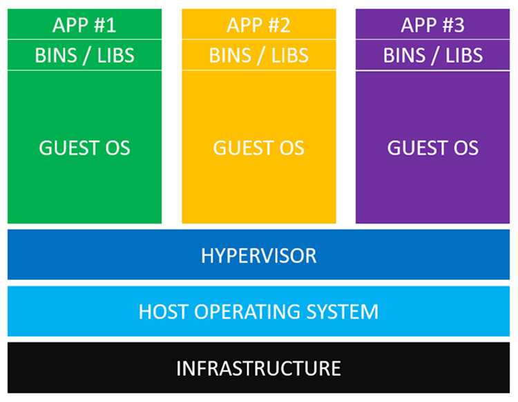
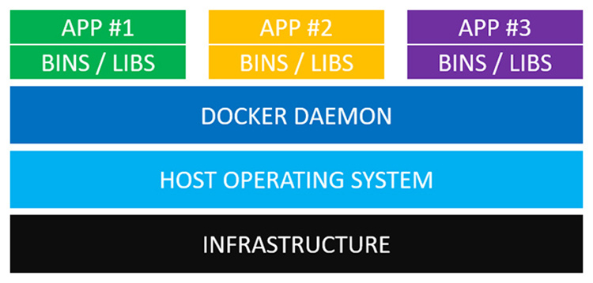

# Architecture

## Comparing Virtual Machines vs Docker Containers:
La première chose que vous devez savoir est que les conteneurs Docker ne sont pas des machines virtuelles.

En 2014, lorsque j'ai découvert le concept de conteneurs Docker, je les ai décrits comme des types de machines virtuelles légères ou allégées.

Cela semblait plutôt cool sur le papier et la comparaison était logique, car le marketing initial de Docker s’appuyait beaucoup sur elle, car elle utilisait moins de mémoire et démarrait beaucoup plus rapidement que les machines virtuelles.

Ils ont continué à lancer des phrases telles que «contrairement à un ordinateur virtuel qui démarre en quelques minutes, les conteneurs Docker démarrent dans environ 50 millisecondes» et partout où j'ai regardé, il y avait des comparaisons avec des ordinateurs virtuels.

Donc, encore une fois… Les conteneurs Docker ne sont pas des ordinateurs virtuels, mais nous allons les comparer.

### Comprendre les machines virtuelles

Définissons maintenant ces couches de bas en haut:

* Tout commence par une sorte d'infrastructure. Il peut s’agir de votre ordinateur portable, d’un serveur dédié fonctionnant dans un centre de données ou d’un serveur privé virtuel que vous utilisez dans le nuage, tel que DigitalOcean ou une instance Amazon EC2.

* En plus de cet hôte exécute un système d'exploitation. Sur votre ordinateur portable, ce sera probablement MacOS, Windows ou une distribution de Linux. Lorsque nous parlons de machines virtuelles, il s’agit généralement du système d’exploitation hôte.

* Ensuite, nous avons une chose appelée un hyperviseur. Vous pouvez considérer les machines virtuelles comme un ordinateur autonome regroupé dans un fichier unique, mais vous devez être en mesure d'exécuter ce fichier. Les hyperviseurs de type 1 courants sont HyperKit pour MacOS, Hyper-V pour Windows et KVM pour Linux. Les hyperviseurs de type 2 populaires sont VirtualBox et VMWare. C’est tout ce que vous devez savoir pour le moment.

* La couche suivante de ce délicieux serveur contient vos systèmes d’exploitation invités. Supposons que vous vouliez exécuter 3 applications sur votre serveur en isolation totale. Cela nécessiterait de lancer 3 systèmes d'exploitation invités, tous contrôlés par votre hyperviseur.

* Les machines virtuelles sont livrées avec beaucoup de bagages. Chaque système d'exploitation invité peut atteindre 700 Mo.

* Cela signifie que vous utilisez 2,1 Gb d’espace disque uniquement pour vos systèmes d’exploitation invités. La situation empire car chaque SE invité a également besoin de ses propres ressources en processeur et en mémoire.

* De plus, chaque SE invité a besoin de sa propre copie de divers fichiers binaires et bibliothèques pour permettre à l’application de fonctionner. Par exemple, vous devrez peut-être installer libpq-dev pour que la bibliothèque de votre application Web permettant la connexion à PostgreSQL puisse se connecter à votre base de données PostgreSQL.
Si vous utilisez quelque chose comme Ruby, vous devez installer vos gemmes. De même avec Python ou NodeJS, vous installeriez vos paquets. À peu près tous les principaux langages de programmation ont leur propre gestionnaire de paquets, vous voyez l'idée.
Étant donné que chaque application est différente, il est prévu que chaque application aura son propre ensemble d'exigences de bibliothèque.

* Enfin, nous avons notre application. C’est le code source de l’application géniale que vous avez construite. Si vous souhaitez que chaque application soit isolée, vous devez les exécuter dans son propre système d'exploitation invité.

### Comprendre les conteneurs Docker:
Voici à quoi ressemble la même configuration avec les conteneurs Docker:

* Les conteneurs Docker ne sont pas des balles magiques. Nous avons encore besoin d'une sorte d'infrastructure pour les faire fonctionner. Comme les ordinateurs virtuels, cela pourrait être votre ordinateur portable ou un serveur quelque part dans le cloud.

* Ensuite, nous avons notre système d'exploitation hôte. Cela pourrait être tout ce que vous voulez capable de faire fonctionner Docker. Toutes les principales distributions de Linux sont prises en charge et il existe également des moyens d’exécuter Docker sous MacOS et Windows.

* Ah, enfin quelque chose de nouveau. Le démon Docker remplace l'hyperviseur. Le démon Docker est un service qui s'exécute en arrière-plan sur votre système d'exploitation hôte et gère tout ce qui est nécessaire pour exécuter et interagir avec les conteneurs Docker.

* Ensuite, nous avons nos fichiers binaires et nos bibliothèques, comme nous le faisons sur les machines virtuelles. Au lieu d’être exécutées sur un système d’exploitation invité, elles sont intégrées à des packages spéciaux appelés images Docker. Ensuite, le démon Docker exécute ces images.

* La dernière pièce du puzzle est nos applications. Chacune d'elles résiderait dans sa propre image Docker et serait gérée indépendamment par le démon Docker. En règle générale, chaque application et ses dépendances de bibliothèque sont regroupées dans la même image Docker. Comme vous pouvez le constater, chaque application est toujours isolée.

### Différences dans le monde réel entre les deux technologies:

Au cas où vous ne le remarqueriez pas, Docker contient beaucoup moins de pièces en mouvement. Nous n’avons besoin d’exécuter aucun type d’hyperviseur ou de machine virtuelle.

Au lieu de cela, le démon Docker communique directement avec le système d'exploitation hôte et sait comment rationner les ressources pour les conteneurs Docker en cours d'exécution. C’est également un expert en matière d’assurance que chaque conteneur est isolé du système d’exploitation hôte et des autres conteneurs.

La différence du monde réel signifie ici qu'au lieu d'attendre une minute le démarrage d'une machine virtuelle, vous pouvez démarrer un conteneur de menu fixe en quelques millisecondes.

Vous économisez également une tonne d'espace disque et d'autres ressources système car vous n'avez pas besoin de trimballer un système d'exploitation invité volumineux pour chaque application que vous exécutez. De plus, Docker n’a pas besoin de virtualisation, car il s’exécute directement sur le système d’exploitation hôte.

Cela dit, ne laissez pas cet article vous donner votre opinion sur les machines virtuelles. Les deux machines virtuelles et Docker ont des cas d'utilisation différents à mon avis.

Les machines virtuelles sont très efficaces pour isoler les ressources système et des environnements de travail entiers. Par exemple, si vous êtes propriétaire d'une société d'hébergement Web, vous utiliserez probablement des machines virtuelles pour séparer chaque client.

En revanche, la philosophie de Docker est d’isoler les applications individuelles et non les systèmes entiers. Un exemple parfait serait de scinder un ensemble de services d’application Web en leurs propres images Docker.