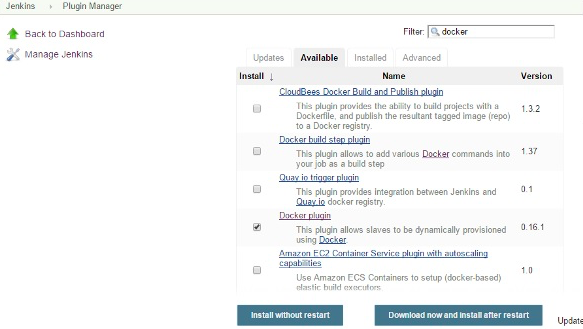

# Intégration continue

Docker est intégré à de nombreux outils d’intégration continue, qui incluent également le célèbre outil CI appelé Jenkins. Dans Jenkins, vous avez des plugins disponibles qui peuvent être utilisés pour travailler avec des conteneurs. Voyons donc rapidement un plugin Docker disponible pour l’outil Jenkins.

Voyons étape par étape ce qui est disponible dans Jenkins pour les conteneurs Docker.

## Étape 1
Accédez au tableau de bord Jenkins et cliquez sur Gérer Jenkins.


## Étape 2
Allez à gérer les plugins.


## Étape 3
Recherchez les plugins Docker. Choisissez le plugin Docker et cliquez sur le bouton Installer sans redémarrer.



## Étape 4
Une fois l'installation terminée, accédez à votre travail dans le tableau de bord Jenkins. Dans notre exemple, nous avons un travail appelé Demo.


## Étape 5
Dans le travail, lorsque vous passez à l’étape Générer, vous pouvez maintenant voir l’option permettant de démarrer et d’arrêter les conteneurs.


## Étape 6
À titre d’exemple simple, vous pouvez choisir l’option supplémentaire permettant d’arrêter les conteneurs une fois la construction terminée. Ensuite, cliquez sur le bouton Enregistrer.


Maintenant, lancez votre travail à Jenkins. Dans la sortie de la console, vous pourrez maintenant voir que la commande Arrêter tous les conteneurs a été exécutée.


```sh
$ curl -L "https://github.com/docker/compose/releases/download/1.10.0-rc2/dockercompose
   -$(uname -s) -$(uname -m)" -o /home/demo/docker-compose
```


