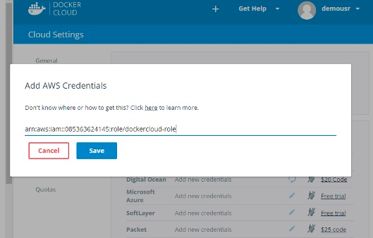
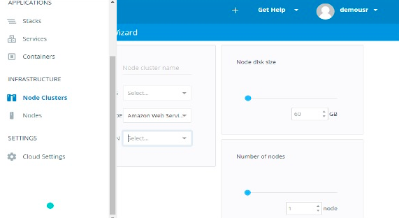

# Cloud

Le Cloud Docker est un service fourni par Docker dans lequel vous pouvez effectuer les opérations suivantes:
* Nœuds - Vous pouvez connecter le cloud Docker à vos fournisseurs de cloud existants, tels qu'Azure et AWS, pour créer des conteneurs sur ces environnements.
* Cloud Repository - Fournit un endroit où vous pouvez stocker vos propres référentiels.
* Intégration continue - Connectez-vous à Github et créez un pipeline d’intégration continue.
* Déploiement d'applications - Déployez et mettez à l'échelle l'infrastructure et les conteneurs.
* Déploiement continu - Peut automatiser les déploiements.

## Commencer
Vous pouvez vous rendre sur le lien suivant pour commencer à utiliser Docker Cloud: https://cloud.docker.com/
Une fois connecté, l'interface de base suivante vous sera fournie


## Connexion au fournisseur de cloud

La première étape consiste à vous connecter à un fournisseur de cloud existant. Les étapes suivantes vous montreront comment se connecter à un fournisseur Amazon Cloud.

### Étape 1
La première étape consiste à vérifier que vous disposez des bonnes clés AWS. Cela peut être pris à partir de la console aws. Connectez-vous à votre compte aws en utilisant le lien suivant: https://aws.amazon.com/console/


### Étape 2
Une fois connecté, accédez à la section Informations d'identification de sécurité. Notez les clés d’accès qui seront utilisées à partir de Docker Hub.


### Étape 3
Ensuite, vous devez créer une stratégie dans aws qui permettra à Docker de visualiser les instances EC2. Accédez à la section des profils dans aws. Cliquez sur le bouton Créer une politique.


### Étape 4
Cliquez sur ‘Créer votre propre stratégie’ et attribuez-lui le nom de stratégie dockercloudpolicy et la définition de la stratégie comme indiqué ci-dessous.
```sh
{ 
   "Version": "2012-10-17", 
   "Statement": [ { 
      "Action": [ 
         "ec2:*", 
         "iam:ListInstanceProfiles" 
      ], 
      "Effect": "Allow", 
      "Resource": "*" 
   } ] 
}
```


### Étape 5
Ensuite, vous devez créer un rôle qui sera utilisé par Docker pour créer des nœuds sur AWS. Pour cela, accédez à la section Rôles dans AWS et cliquez sur l'option Créer un nouveau rôle.


### Étape 6
Nommez le rôle dockercloud-role


### Étape 7
Sur l’écran suivant, allez à "Rôle pour accès entre comptes" et sélectionnez "Fournir un accès entre votre compte et un compte AWS tiers".


### Étape 8
Sur l’écran suivant, entrez les détails suivants:
* Dans le champ ID du compte, entrez l'ID du service Docker Cloud: 689684103426.
* Dans le champ External ID, entrez votre nom d'utilisateur Docker Cloud.


### Étape 9 
Ensuite, cliquez sur le bouton Étape suivante et, dans l'écran suivant, joignez la stratégie créée à l'étape précédente.


### Étape 10
Enfin, sur le dernier écran lors de la création du rôle, veillez à copier le rôle créé.
```sh
arn:aws:iam::085363624145:role/dockercloud-role
```


### Étape 11
Revenez maintenant à Docker Cloud, sélectionnez Fournisseurs de cloud, puis cliquez sur le symbole de prise en regard d'Amazon Web Services.


Entrez le rôle et cliquez sur le bouton Enregistrer.



Une fois enregistrée, l'intégration avec AWS serait terminée.


## Configuration des nœuds
Une fois l'intégration avec AWS terminée, l'étape suivante consiste à configurer un nœud. Accédez à la section Nœuds dans Docker Cloud. Notez que la configuration des nœuds configure automatiquement un cluster de nœuds en premier.

### Étape 1
Accédez à la section Nœuds dans Docker Cloud.



### Étape 2
Ensuite, vous pouvez donner les détails des noeuds qui seront configurés dans AWS.


Vous pouvez ensuite cliquer sur le cluster Launch Node qui sera présent au bas de l'écran. Une fois le nœud déployé, vous recevrez la notification dans l'écran Cluster Node.


## Déploiement d'un service
Après le déploiement d'un nœud, l'étape suivante consiste à déployer un service. Pour ce faire, nous devons effectuer les étapes suivantes.

### Étape 1
Accédez à la section Services de Docker Cloud. Cliquez sur le bouton Créer


### Étape 2
Choisissez le service requis. Dans notre cas, choisissons le mongo.


### Étape 3
Sur l’écran suivant, choisissez l’option Créer et déployer. Cela va commencer à déployer le conteneur Mongo sur votre cluster de nœuds.


Une fois déployé, vous pourrez voir le conteneur dans un état en cours d'exécution.


