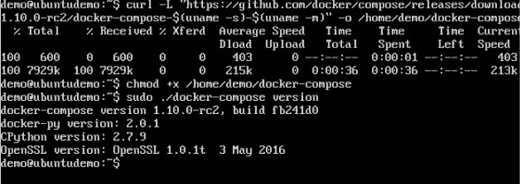

# Docker Compose

Docker Compose est utilisé pour exécuter plusieurs conteneurs en tant que service unique. Par exemple, supposons que vous ayez une application nécessitant NGNIX et MySQL, vous pouvez créer un fichier qui lance les deux conteneurs en tant que service sans qu'il soit nécessaire de les démarrer séparément.

Dans ce chapitre, nous verrons comment commencer à utiliser Docker Compose. Ensuite, nous verrons comment obtenir un service simple avec MySQL et NGNIX opérationnel avec Docker Compose.

## Installation
Les étapes suivantes doivent être suivies pour que Docker Compose soit opérationnel.

### Étape 1
Téléchargez les fichiers nécessaires à partir de github en utilisant la commande suivante
```sh
$ curl -L "https://github.com/docker/compose/releases/download/1.10.0-rc2/dockercompose
   -$(uname -s) -$(uname -m)" -o /home/demo/docker-compose
```
La commande ci-dessus téléchargera la dernière version de Docker Compose qui, au moment de la rédaction de cet article, est 1.10.0-rc2. Il sera ensuite stocké dans le répertoire /home/demo/.

### Étape 2
Ensuite, nous devons fournir les privilèges d'exécution au fichier Docker Compose téléchargé, à l'aide de la commande suivante
```sh
$ chmod +x /home/demo/docker-compose
```

Nous pouvons ensuite utiliser la commande suivante pour voir la version composée.
```sh
$ sudo ./docker-compose -version
```
Output



## Création de votre premier fichier Docker-Compose
Continuons maintenant et créons notre premier fichier Docker Compose. Tous les fichiers Docker Compose sont des fichiers YAML. Vous pouvez en créer un en utilisant l'éditeur vim. Alors exécutez la commande suivante pour créer le fichier de composition
```sh
$ sudo vim docker-compose.yml
```


Examinons de près les différents détails de ce fichier:

* La base de données et le mot clé Web permettent de définir deux services distincts. L’un utilisera notre base de données mysql et l’autre sera notre serveur Web nginx.
* Le mot clé image est utilisé pour spécifier l'image à partir de dockerhub pour nos conteneurs mysql et nginx
* Pour la base de données, nous utilisons le mot-clé ports pour mentionner les ports devant être exposés pour mysql.
* Et ensuite, nous spécifions également les variables d'environnement pour mysql qui sont nécessaires pour exécuter mysql.

Maintenant, exécutons notre fichier Docker Compose en utilisant la commande suivante:
```sh
$ sudo ./docker-compose up
```
Cette commande prendra le fichier docker-compose.yml dans votre répertoire local et commencera à créer les conteneurs.
Une fois exécutées, toutes les images commenceront à télécharger et les conteneurs commenceront automatiquement.
Et lorsque vous effectuez un docker ps, vous pouvez voir que les conteneurs sont effectivement opérationnels.


