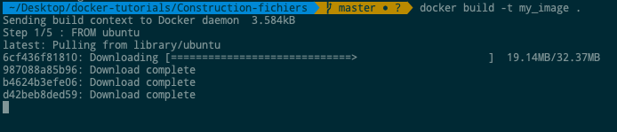

# Construction de fichiers

Nous avons créé notre fichier Docker dans le dernier chapitre. Il est maintenant temps de créer le fichier Docker. Le fichier Docker peut être construit avec la commande suivante
```sh
$ sudo docker build
```

## docker build
```sh
$ sudo docker build  -t ImageName:TagName dir
```
* -t - est de mentionner une balise à l'image
* ImageName - C'est le nom que vous voulez donner à votre image.
* TagName - Ceci est la balise que vous voulez donner à votre image.
* Dir - Le répertoire où le fichier Docker est présent.

### Exemple:
```sh
docker build -t my_image .
```

Output:



