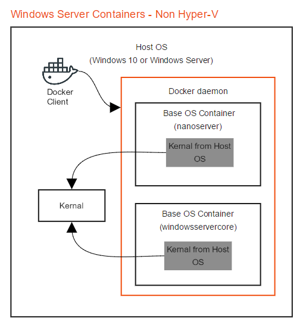
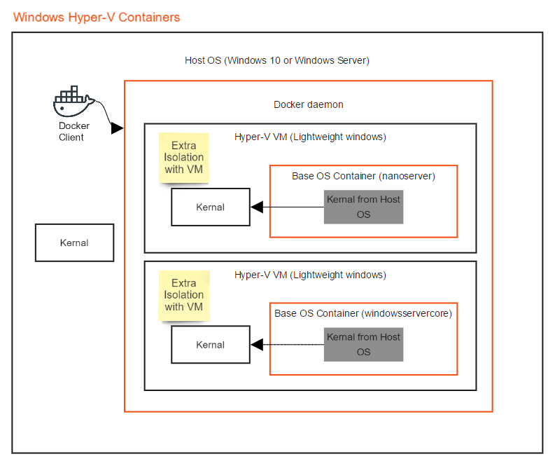

# Container and Hosts

La bonne chose à propos du moteur Docker est qu’il est conçu pour fonctionner sur différents systèmes d’exploitation. Nous avons déjà vu l'installation sur Linux et toutes les commandes Docker sur les systèmes Linux.

## Comprendre Docker "Container Host" vs. "Container OS" for Linux et Windows Containers

Permet d'explorer la relation entre «Container Host» et le «Container OS» et leur différence entre les conteneurs Linux et Windows.

* Container Host: également appelé système d'exploitation hôte. Le système d'exploitation hôte est le système d'exploitation sur lequel le client Docker et le démon Docker s'exécutent. Dans le cas de conteneurs Linux et non-Hyper-V, le système d'exploitation hôte partage son noyau avec les conteneurs Docker en cours d'exécution. Pour Hyper-V, chaque conteneur a son propre noyau Hyper-V.
* Container OS: Aussi appelé système d'exploitation de base. Le système d'exploitation de base fait référence à une image contenant un système d'exploitation tel que Ubuntu, CentOS ou windowsservercore. En règle générale, vous construisez votre propre image par-dessus une image du système d'exploitation de base afin de pouvoir utiliser certaines parties du système d'exploitation. Notez que les conteneurs Windows requièrent un système d'exploitation de base, contrairement aux conteneurs Linux.
* Operating System Kernel: le noyau gère les fonctions de niveau inférieur telles que la gestion de la mémoire, le système de fichiers, la planification du réseau et des processus.

