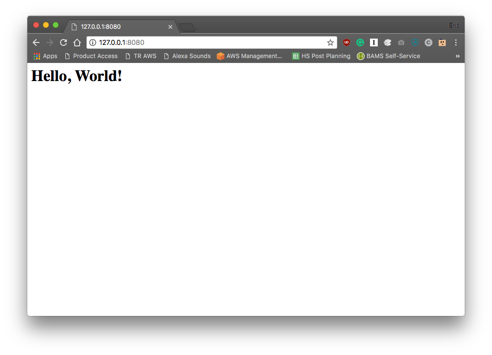

# Containers and Shells

Par défaut, lorsque vous lancez un conteneur, vous utiliserez également une commande shell lors du lancement du conteneur, comme indiqué ci-dessous. C'est ce que nous avons vu dans les chapitres précédents lorsque nous travaillions avec des conteneurs.

```sh
$ sudo docker run -i -t centos /bin/bash 
```
Nous avons utilisé cette commande pour créer un nouveau conteneur, puis la commande Ctrl + P + Q pour sortir du conteneur. Cela garantit que le conteneur existe toujours, même après sa sortie du conteneur.

## Partager des ressources système avec un conteneur

Jusqu'à présent, nous avons créé quelques images autonomes. Que se passe-t-il lorsque nous souhaitons partager des ressources locales de notre système hôte avec un conteneur? Docker peut partager le système de fichiers et la pile réseau avec des conteneurs.

Créons un serveur Web qui sert une page Web à partir du système de fichiers local. Nous allons utiliser une image publique Nginx.

Tout d'abord, nous avons besoin d'un fichier HTML à afficher lorsque nous nous connectons au serveur Web. Démarrez dans un répertoire vide appelé my-nginx et créez un seul sous-répertoire nommé html. Dans html, créez index.html:

```sh
$ sudo docker run -v /full/path/to/html/directory:/usr/share/nginx/html:ro -p 8080:80 -d nginx
```
Lorsque nous exécutons cette ligne de commande, nous voyons Docker télécharger l'image Nginx, puis démarrer le conteneur.

* Nous avons utilisé quatre options de ligne de commande pour exécuter ce conteneur:

  * -v /full/path/to/html/directory:/usr/share/nginx/html:ro mappe le répertoire contenant notre page Web vers l'emplacement requis dans l'image. Le champ ro indique à Docker de le monter en mode lecture seule. Il est préférable de transmettre à Docker les chemins complets lors de la spécification des répertoires d’hôte.  
  * -p 8080:80 mappe le port de service réseau 80 du conteneur sur 8080 sur notre système hôte.
  * -d détache le conteneur de notre session en ligne de commande. Contrairement à nos deux exemples précédents, nous ne souhaitons pas interagir avec ce conteneur.
  * nginx est le nom de l'image.

Après avoir exécuté cette commande, nous devrions pouvoir atteindre le serveur Web sur le port 8080:



Nous voyons notre page de test! Vous pouvez également accéder à la page de nos périphériques de votre réseau à l’aide de l’adresse IP de votre système hôte.

Lorsque nous avons exécuté l’image Nginx, nous devions lui indiquer où obtenir les fichiers Web. Pour ce faire, nous avons monté un répertoire sur notre système hôte dans un répertoire situé à l'intérieur du conteneur, en remplaçant les fichiers déjà présents dans l'image. Docker prend également en charge les volumes pouvant contenir des systèmes de fichiers et être partagés entre des conteneurs.

Nous devions également mapper le port 80 de notre conteneur sur un port de notre système hôte afin que le serveur Web puisse communiquer avec le monde extérieur. Les conteneurs n’ont pas automatiquement accès au réseau hôte. Avec notre directive de mappage de port, le conteneur est accessible via le réseau hôte. Comme nous avons uniquement mappé ce port, aucune autre ressource réseau n'est disponible pour le conteneur.

## Créer une image Docker

Maintenant, construisons sur cet exemple pour créer notre propre image. Nous allons empaqueter l’image Nginx avec notre fichier html.

Les images sont créées avec un [fichier Docker](https://docs.docker.com/engine/reference/builder/), qui répertorie les composants et les commandes qui composent une image.

créer un fichier Docker:
```sh
FROM nginx
COPY html /usr/share/nginx/html
```
Ce fichier Dockerfile contient deux instructions:

* Tout d’abord, créez cette image à partir d’une image existante, nommée nginx. L'instruction FROM est une exigence pour tous les fichiers Dockerfiles et établit l'image de base. Les instructions suivantes sont exécutées sur l'image de base.
* La deuxième instruction, COPY, indique à Docker de copier notre arborescence de fichiers dans l'image de base, en remplaçant le contenu de / usr / share / nginx / html dans l'image de base.

Next, build the image::
```sh
$ sudo docker build -t mynginx .

output:
Sending build context to Docker daemon 3.584kB
Step 1/2 : FROM nginx
---> b175e7467d66
Step 2/2 : COPY html /usr/share/nginx/html
---> Using cache
---> a8b02c2e09a4
Successfully built a8b02c2e09a4
Successfully tagged mynginx:latest
```
Nous avons passé deux arguments pour construire:
* -t mynginx a donné à Docker une étiquette pour l'image. Comme nous n’avons fourni qu’un nom, nous pouvons voir que Docker a étiqueté cette version comme la dernière de la dernière ligne de la sortie de la version. Nous examinerons de plus près le marquage ci-dessous.
* Le dernier argument, point (ou «.»), A demandé à Docker de rechercher le fichier Docker dans le répertoire de travail en cours.


