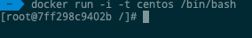

# Containers


Les conteneurs sont des instances d'images Docker pouvant être exécutées à l'aide de la commande d'exécution Docker. L'objectif principal de Docker est d'exécuter des conteneurs. Voyons comment travailler avec des conteneurs.

## Exécuter un conteneur:
L'exécution des conteneurs est gérée à l'aide de la commande d'exécution Docker. Pour exécuter un conteneur en mode interactif, lancez d'abord le conteneur Docker.
```sh
$ sudo docker run –it centos /bin/bash
```

output:



## Liste de conteneurs:
Pour voir la liste des images Docker sur le système, vous pouvez exécuter la commande suivante.
```sh
$ sudo docker container ps
```

## Docker Cheat Sheet:

[](docker-cheat-heet.png)


