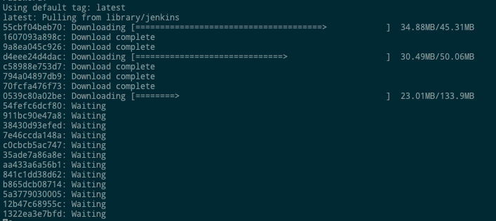
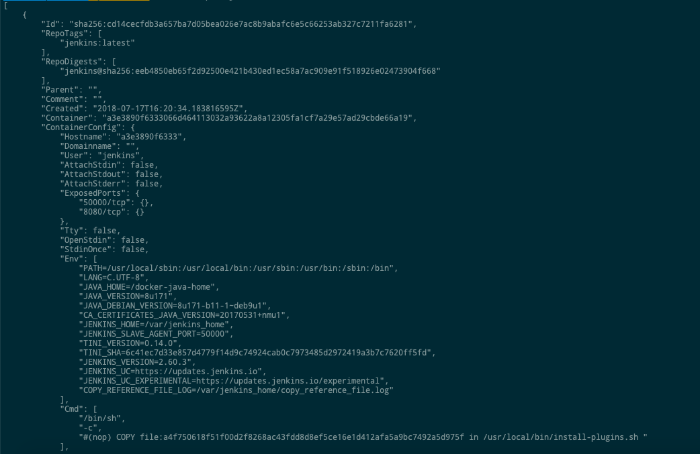
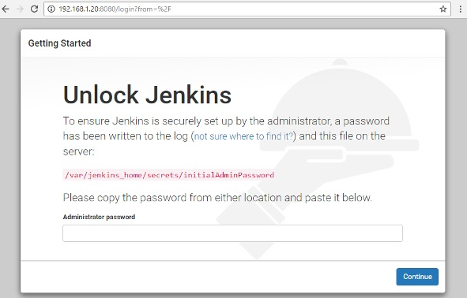

# Gestion des ports

Dans Docker, les conteneurs eux-mêmes peuvent avoir des applications s'exécutant sur des ports. Lorsque vous exécutez un conteneur, si vous souhaitez accéder à l'application qu'il contient via un numéro de port, vous devez mapper le numéro de port du conteneur sur le numéro de port de l'hôte Docker. Voyons un exemple de la façon dont cela peut être réalisé.

## Exemple:
Dans notre exemple, nous allons télécharger le conteneur Jenkins à partir de Docker Hub. Nous allons ensuite mapper le numéro de port Jenkins au numéro de port sur l'hôte Docker.
```sh
$ sudo docker pull jenkins 
```



* Pour comprendre quels ports sont exposés par le conteneur, vous devez utiliser la commande inspecter Docker pour inspecter l'image.
```sh
$ sudo docker inspect jenkins 
```

output:



La sortie de la commande inspecte donne une sortie JSON. Si nous observons la sortie, nous pouvons voir qu’il existe une section de "ExposedPorts" et voir que deux ports sont mentionnés. L'un est le port de données de 8080 et l'autre est le port de contrôle de 50000.


* To run Jenkins and map the ports, you need to change the Docker run command and add the ‘p’ option which specifies the port mapping. So, you need to run the following command
```sh
$ sudo docker run -p 8080:8080 -p 50000:50000 jenkins 
```
Le côté gauche du mappage de numéro de port est le port de l'hôte Docker vers lequel mapper et le côté droit est le numéro de port du conteneur Docker.

* Lorsque vous ouvrez le navigateur et accédez à l'hôte Docker sur le port 8080, Jenkins est opérationnel.

