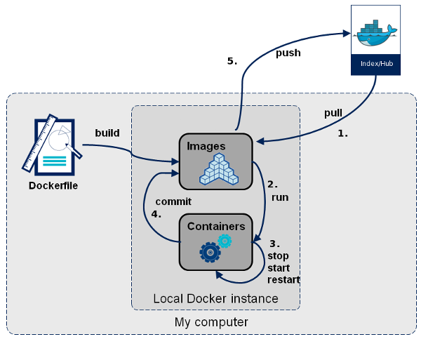
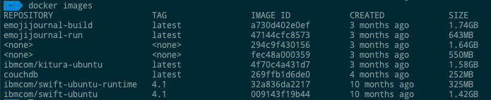

# Images



Dans Docker, tout est basé sur Images. Une image est une combinaison d'un système de fichiers et de paramètres. Prenons un exemple de la commande suivante dans Docker.
```sh
$ docker run hello-world 
```
* La commande Docker est spécifique et indique au programme Docker du système d’exploitation qu’il faut faire quelque chose.
* La commande run est utilisée pour indiquer que nous voulons créer une instance d'une image, qui s'appelle alors un conteneur.
* Enfin, "hello-world" représente l'image à partir de laquelle le conteneur est fabriqué.

## Exemple:
Voyons comment utiliser l’image CentOS disponible dans Docker Hub pour exécuter CentOS sur notre ordinateur Ubuntu. Nous pouvons le faire en exécutant la commande suivante sur notre machine Ubuntu:
```sh
$ sudo docker run centos –it /bin/bash
```
* Nous utilisons la commande sudo pour nous assurer qu’elle fonctionne avec un accès root.
* Centos est le nom de l'image que nous voulons télécharger depuis Docker Hub et installer sur notre machine Ubuntu.
* Il est utilisé pour mentionner que nous voulons fonctionner en mode interactif.
* /bin/bash est utilisé pour exécuter le shell bash une fois que CentOS est opérationnel.

## Affichage des images Docker:
Pour voir la liste des images Docker sur le système, vous pouvez exécuter la commande suivante.
```sh
$ sudo docker images
```
* Output:



Chaque image a les attributs suivants:
* TAG − This is used to logically tag images.
* Image ID − This is used to uniquely identify the image.
* Created − The number of days since the image was created.
* Size − The size of the image.

## Téléchargement d'images Docker:
```sh
$ docker run image
```

## Suppression des images Docker:
```sh
$ docker rmi ImageID
```

## docker inspect:
```sh
$ docker inspect Repository
```
* Exemple:
```sh
$ sudo docker inspect couchdb
```
Output:
```sh
  [
    {
        "Id": "sha256:269ffb1d6de06ceee9dc67f21ce4c9a98c72c64ae75beb717cd3891f6f17c24b",
        "RepoTags": [
            "couchdb:latest"
        ],
        "RepoDigests": [
            "couchdb@sha256:7d60986a0b43015711121909c50b94dd6a1a6520f8f4bc72f52109b9ea8a17ad"
        ],
        "Parent": "",
        "Comment": "",
        "Created": "2018-10-16T01:38:59.501794757Z",
        "Container": "70735b7b1c0ae12bd92fc6c9c489f77243d9b149d3951a0b1250fd442c3cf837",
        "ContainerConfig": {
            "Hostname": "70735b7b1c0a",
            "Domainname": "",
            "User": "",
            "AttachStdin": false,
            "AttachStdout": false,
            "AttachStderr": false,
            "ExposedPorts": {
                "4369/tcp": {},
                "5984/tcp": {},
                "9100/tcp": {}
            },
            "Tty": false,
            "OpenStdin": false,
            "StdinOnce": false,
            "Env": [
                "PATH=/usr/local/sbin:/usr/local/bin:/usr/sbin:/usr/bin:/sbin:/bin",
                "GOSU_VERSION=1.10",
                "TINI_VERSION=0.16.1",
                "GPG_KEYS=15DD4F3B8AACA54740EB78C7B7B7C53943ECCEE1   1CFBFA43C19B6DF4A0CA3934669C02FFDF3CEBA3   25BBBAC113C1BFD5AA594A4C9F96B92930380381   4BFCA2B99BADC6F9F105BEC9C5E32E2D6B065BFB   5D680346FAA3E51B29DBCB681015F68F9DA248BC   7BCCEB868313DDA925DF1805ECA5BCB7BB9656B0   C3F4DFAEAD621E1C94523AEEC376457E61D50B88   D2B17F9DA23C0A10991AF2E3D9EE01E47852AEE4   E0AF0A194D55C84E4A19A801CDB0C0F904F4EE9B   29E4F38113DF707D722A6EF91FE9AF73118F1A7C   2EC788AE3F239FA13E82D215CDE711289384AE37",
                "COUCHDB_VERSION=2.2.0"
            ],
            "Cmd": [
                "/bin/sh",
                "-c",
                "#(nop) ",
                "CMD [\"/opt/couchdb/bin/couchdb\"]"
            ],
            "ArgsEscaped": true,
            "Image": "sha256:e5fa399062532c209120babef4438265d02293dc766b410b42c4df6d888afc85",
            "Volumes": {
                "/opt/couchdb/data": {}
            },
            "WorkingDir": "/opt/couchdb",
            "Entrypoint": [
                "tini",
                "--",
                "/docker-entrypoint.sh"
            ],
            "OnBuild": [],
            "Labels": {}
        },
        "DockerVersion": "17.06.2-ce",
        "Author": "CouchDB Developers dev@couchdb.apache.org",
        "Config": {
            "Hostname": "",
            "Domainname": "",
            "User": "",
            "AttachStdin": false,
            "AttachStdout": false,
            "AttachStderr": false,
            "ExposedPorts": {
                "4369/tcp": {},
                "5984/tcp": {},
                "9100/tcp": {}
            },
            "Tty": false,
            "OpenStdin": false,
            "StdinOnce": false,
            "Env": [
                "PATH=/usr/local/sbin:/usr/local/bin:/usr/sbin:/usr/bin:/sbin:/bin",
                "GOSU_VERSION=1.10",
                "TINI_VERSION=0.16.1",
                "GPG_KEYS=15DD4F3B8AACA54740EB78C7B7B7C53943ECCEE1   1CFBFA43C19B6DF4A0CA3934669C02FFDF3CEBA3   25BBBAC113C1BFD5AA594A4C9F96B92930380381   4BFCA2B99BADC6F9F105BEC9C5E32E2D6B065BFB   5D680346FAA3E51B29DBCB681015F68F9DA248BC   7BCCEB868313DDA925DF1805ECA5BCB7BB9656B0   C3F4DFAEAD621E1C94523AEEC376457E61D50B88   D2B17F9DA23C0A10991AF2E3D9EE01E47852AEE4   E0AF0A194D55C84E4A19A801CDB0C0F904F4EE9B   29E4F38113DF707D722A6EF91FE9AF73118F1A7C   2EC788AE3F239FA13E82D215CDE711289384AE37",
                "COUCHDB_VERSION=2.2.0"
            ],
            "Cmd": [
                "/opt/couchdb/bin/couchdb"
            ],
            "ArgsEscaped": true,
            "Image": "sha256:e5fa399062532c209120babef4438265d02293dc766b410b42c4df6d888afc85",
            "Volumes": {
                "/opt/couchdb/data": {}
            },
            "WorkingDir": "/opt/couchdb",
            "Entrypoint": [
                "tini",
                "--",
                "/docker-entrypoint.sh"
            ],
            "OnBuild": [],
            "Labels": null
        },
        "Architecture": "amd64",
        "Os": "linux",
        "Size": 252239692,
        "VirtualSize": 252239692,
        "GraphDriver": {
            "Data": {
                "LowerDir": "/var/lib/docker/overlay2/568d41e3aea8fea032fe13a8d8812c40673ede17534e806781e10d2a7a50726b/diff:/var/lib/docker/overlay2/3544503aac04726cd6cd895b5158b47adee005f5155a9e5c71ce6b1a82805cb6/diff:/var/lib/docker/overlay2/23492bec80154e2f3aa079902f5dbfb166c35dad68bdcf66d7e732973603299e/diff:/var/lib/docker/overlay2/1dce1c692b0729aa04c8b031ac0788f59029c7edca8be25678f6305036b2f719/diff:/var/lib/docker/overlay2/51a7a05cdc92919cb5a4306e78792d5403ff0a16a7921f09aa3304b3871b4a2e/diff:/var/lib/docker/overlay2/c65cefb2e61e4a5a8af5fb90a5d3994001a61720d4bc0a4276bf683d3f9667e9/diff:/var/lib/docker/overlay2/944056cd33cd8b5b2314f2bc45ce9536ea49dce0d2dc172407866731fbb976ac/diff:/var/lib/docker/overlay2/931273e9d77ff341e84c23e72f358e1095755e1ab73b43b9c920482dfd580c77/diff:/var/lib/docker/overlay2/d8e3c1e9dccdc90e1b9f74d14d28cf94878004105a81c5bd6b027716c78526cd/diff",
                "MergedDir": "/var/lib/docker/overlay2/3cbecfa24556b25bff395054f9921b7523b3dcf3e95113f8def7dfe396b05c3c/merged",
                "UpperDir": "/var/lib/docker/overlay2/3cbecfa24556b25bff395054f9921b7523b3dcf3e95113f8def7dfe396b05c3c/diff",
                "WorkDir": "/var/lib/docker/overlay2/3cbecfa24556b25bff395054f9921b7523b3dcf3e95113f8def7dfe396b05c3c/work"
            },
            "Name": "overlay2"
        },
        "RootFS": {
            "Type": "layers",
            "Layers": [
                "sha256:f715ed19c28b66943ac8bc12dbfb828e8394de2530bbaf1ecce906e748e4fdff",
                "sha256:c379b6eddc1be7ab5baa6525136070dd3ec68dab051ed811200d41141d30c1e7",
                "sha256:76fd3ec1268c3d8a73fb8c0312a532be77be17ed087f5d053b00c038c34e8a14",
                "sha256:9f44044270f29d8161c47ce7d7dbdefea5311e5607b9751659f4ddcc8f32251e",
                "sha256:8e20bc15c63db1f55366cd64c19fc2c4dc81d4c8b25ece905b1aa54d4c4529d5",
                "sha256:4b39b481448325d90ce773228cc0e9ce422ea1d58c0917b5f996f5f457bc108d",
                "sha256:0a8277dec77974377783cc4eff91817317ffdbcc50a0a7760c0e6945886b6b2f",
                "sha256:602291f963faed9185db1e4fa3c477b9393a56c0449f623f359fd07b27358aa3",
                "sha256:0448ca461889819cf6755f9aea7373e5b427c4f7b3eba30080a9919002782bdb",
                "sha256:3aa440c00095eb7c44a84985cc1632a8a7ba07c7d02b0adffa20562eef6c3e76"
            ]
        },
        "Metadata": {
            "LastTagTime": "0001-01-01T00:00:00Z"
        }
    }
]
```


