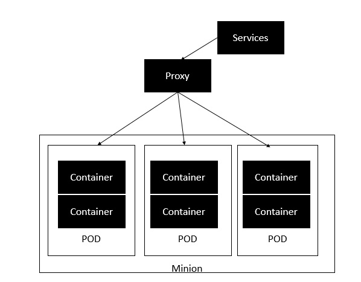

# Architecture Kubernetes

Kubernetes est un framework d'orchestration pour les conteneurs Docker qui aide à exposer les conteneurs en tant que services au monde extérieur. Par exemple, vous pouvez avoir deux services: un service contiendrait nginx et mongoDB, et un autre service contiendrait nginx et redis. Chaque service peut avoir un IP ou un point de service pouvant être connecté par d'autres applications. Kubernetes est ensuite utilisé pour gérer ces services.

Le diagramme suivant montre dans un format simpliste le fonctionnement de Kubernetes du point de vue de l’architecture.

Le séide est le nœud sur lequel tous les services sont exécutés. Vous pouvez avoir plusieurs sbires en cours d'exécution à un moment donné. Chaque séide accueillera un ou plusieurs POD. Chaque POD est comme l'hébergement d'un service. Chaque POD contient ensuite les conteneurs Docker. Chaque POD peut héberger un ensemble différent de conteneurs Docker. Le proxy est ensuite utilisé pour contrôler l'exposition de ces services au monde extérieur.

Kubernetes a plusieurs composants dans son architecture. Le rôle de chaque composant est expliqué ci-dessous & mius;

* etcd - Ce composant est un magasin clé-valeur hautement disponible utilisé pour stocker la configuration partagée et la découverte de services. Ici, les différentes applications pourront se connecter aux services via le service de découverte.
* Flannel - Il s’agit d’un réseau principal qui est requis pour les conteneurs.
* kube-apiserver - Il s'agit d'une API qui peut être utilisée pour orchestrer les conteneurs Docker.
* kube-controller-manager - Ceci est utilisé pour contrôler les services Kubernetes.
* kube-scheduler - Ceci est utilisé pour planifier les conteneurs sur les hôtes.
* Kubelet - Ceci est utilisé pour contrôler le lancement des conteneurs via des fichiers manifest.
* kube-proxy - Ceci est utilisé pour fournir des services de proxy réseau au monde extérieur.

