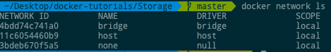
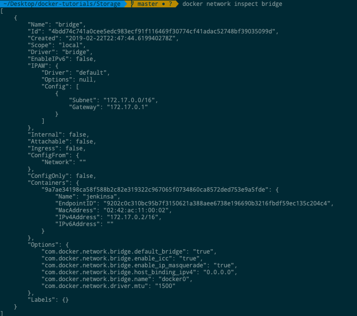
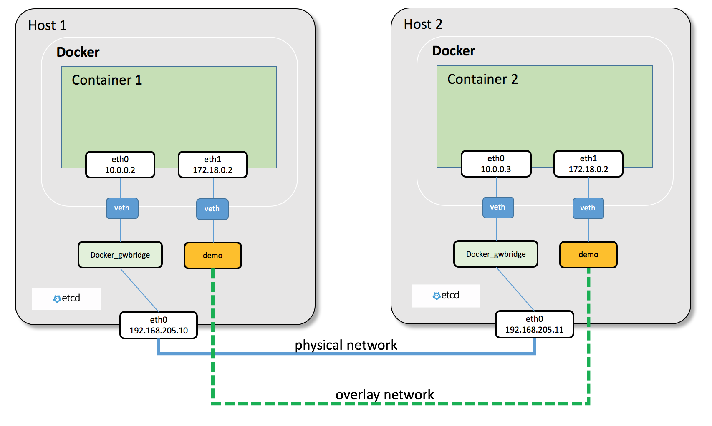
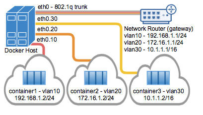

# Networking

Docker prend en charge les aspects de mise en réseau afin que les conteneurs puissent communiquer avec d'autres conteneurs ainsi qu'avec l'hôte Docker. Si vous effectuez un ifconfig sur l'hôte Docker, vous verrez l'adaptateur Ethernet Docker. Cet adaptateur est créé lorsque Docker est installé sur l'hôte Docker.

## Liste de tous les réseaux Docker
```sh
$ sudo docker network ls
```

Output



## Inspection d'un réseau Docker
Si vous souhaitez voir plus de détails sur le réseau associé à Docker, vous pouvez utiliser la commande Docker network inspect.
```sh
$ sudo docker network inspect bridge
```

Output:
vous verrez maintenant que le conteneur 'jenkinsa' est attaché au bridge network:



## Créer votre propre nouveau réseau
```sh
$ sudo docker network create –-driver drivername name 
```
* drivername - C'est le nom utilisé pour le pilote de réseau.
* name - C'est le nom donné au réseau.

Vous pouvez maintenant connecter le nouveau réseau lors du lancement du conteneur. Alors, faisons tourner un conteneur Ubuntu avec la commande suivante:
```sh
$ sudo docker run –it –network=new_nw ubuntu:latest /bin/bash 
```

## Host Networking
Partage la pile TCP/IP, l'espace de noms, etc. du système d'exploitation hôte. Autrement dit, toutes les interfaces réseau définies sur l'hôte seront accessibles au conteneur. La commande ci-dessous connecte l'image du docker microservice au réseau hôte.
```sh
$ sudo docker run --net=host microservice-demo
```

## Bridge Network
Le Bridge Network fournit des capacités de mise en réseau à hôte unique Par défaut, les conteneurs se connectent au réseau de ponts. Chaque fois que le conteneur démarre, il est fourni une adresse IP interne. Tous les conteneurs connectés au pont interne peuvent désormais communiquer entre eux. Mais ils ne peuvent pas communiquer en dehors du réseau du pont.
Cependant, avec l'option -p, nous pouvons mapper le port du menu fixe sur le port natif.
```sh
$ docker run -p 4000:80 microservice-demo
```

## Overlay Networking
Le réseau de superposition fournit un réseau simple et sécurisé à plusieurs hôtes. Le réseau en superposition utilise [VXLAN](https://www.cisco.com/c/en/us/products/collateral/switches/nexus-9000-series-switches/white-paper-c11-729383.html) sur un réseau sous-jacent.
Les conteneurs faisant partie de Overlay Network peuvent communiquer avec des conteneurs, quel que soit l'hôte. Les conteneurs faisant partie du réseau de superposition se voient s’ils se trouvent sur le même réseau L2.



Chaque conteneur du réseau de superposition reçoit deux adresses IP.
First IP permet la communication entre les conteneurs d'un hôte à l'autre. La seconde adresse IP est mappée sur le point de terminaison VXLAN-VTEP et contient toutes les données réelles entre les hôtes.

## Macvlan Driver
Il s’agit d’une manière matérielle de mise en réseau où chaque conteneur se voit attribuer une adresse matérielle ou une adresse MAC. En conséquence, chacun des conteneurs possède une pile TCP/IP complète. Cela signifie donc que chaque conteneur agit comme un périphérique physique directement connecté au réseau sous-jacent.



Macvlan entraîne toutefois des frais supplémentaires de gestion du réseau, car chaque conteneur est désormais un citoyen de première classe du réseau sous-jacent.


