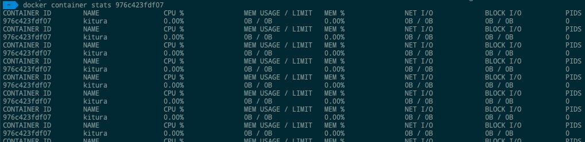

# Containers

Dans ce chapitre, nous explorerons en détail ce que nous pouvons faire avec les conteneurs.

## docker top:
Avec cette commande, vous pouvez voir les principaux processus dans un conteneur.
```sh
$ sudo docker top ContainerID
```
* ContainerID - Il s'agit de l'ID de conteneur pour lequel vous souhaitez voir les principaux processus.

## docker stop:
Cette commande est utilisée pour arrêter un conteneur en cours d'exécution.
```sh
$ sudo docker stop ContainerID 
```

## docker rm:
Cette commande est utilisée pour supprimer un conteneur.
```sh
$ sudo docker rm ContainerID  
```

## docker stats:
Cette commande est utilisée pour fournir les statistiques d'un conteneur en cours d'exécution.
```sh
$ docker stats ContainerID  
```

output:




