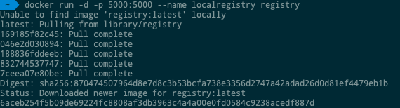
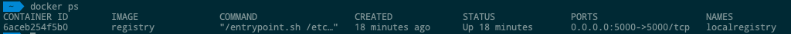

# Registres privés

Vous aurez peut-être besoin de disposer de vos propres référentiels privés. Il se peut que vous ne souhaitiez pas héberger les référentiels sur Docker Hub. Pour cela, il existe un conteneur de référentiel lui-même provenant de Docker. Voyons comment nous pouvons télécharger et utiliser le conteneur pour le registre.

## Déroulez l'image du registre et Exécuter le registre local
Utilisez la commande Docker run pour télécharger le registre privé. Cela peut être fait en utilisant la commande suivante.
```sh
$ sudo docker run -d -p 5000:5000 --name localregistry registry
```
nous commençons un conteneur nommé ‘localregistry’ basé sur l’image ‘registry’. Le conteneur est démarré en mode détaché et le mappage de port hôte: conteneur a été effectué pour les deux numéros de port 5000.



Vérifiez si le conteneur nommé ‘localregistry’ a démarré via la commande docker ps comme indiqué ci-dessous:



## Déroulez quelques images et appuyez sur le registre local

### Étape 1: Déroulez les images busybox et Linux alpin
```sh
$ sudo docker pull busybox
$ sudo docker pull alpine
```
Une fois les images extraites, vérifiez qu’elles figurent dans votre liste d’images via la commande docker images.
Si à ce stade, nous essayons d'extraire l'image alpine de notre registre local, il devrait idéalement répondre avec l'image non trouvée, ne devrait-elle pas? Oui, il sera. N'oubliez pas que nous avons déjà démarré le conteneur de registre sur le port 5000. Le résultat de cette opération est présenté ci-dessous:
```sh
$ sudo docker pull localhost:5000/alpine
Using default tag: latest
Error response from daemon: manifest for localhost:5000/alpine:latest not found
```
Notez que le format de spécification de l'image dans un registre spécifique est le suivant:
```sh
[REGISTRY_HOSTNAME:REGISTRY_PORT]/IMAGENAME
```
Pour Docker Hub public, nous n'avons pas spécifié l'option [REGISTRY_HOSTNAME: REGISTRY_PORT]. Mais pour notre registre local, nous devons spécifier cela afin que le client docker puisse y regarder.

### Étape 2: Insérez les images busybox et Linux alpin dans le registre local.
Nous allons maintenant insérer les deux images téléchargées (busybox et alpine) dans le registre local. N'oubliez pas qu'il s'agit de deux images que vous avez téléchargées directement à partir du hub Docker. Nous ne l'avons pas modifié en aucune façon. Mais vous pouvez créer votre propre image modifiée (comme nous l'avons vu précédemment dans cette série) et l'insérer également dans le registre local.

* La première étape consiste à utiliser votre image ou votre conteneur. Laissez-nous travailler avec l’image alpine que nous avons extraite précédemment. Le nom qualifié complet de cette image est alpine: latest si vous exécutez une commande images docker. Exécutez la commande suivante pour baliser l’alpine: latest image avec la balise du registre local dans lequel nous allons la pousser.
```sh
$ sudo docker tag alpine:latest localhost:5000/alpine:latest
```
Si vous exécutez maintenant une commande d'images fixes, vous verrez les images alpine et localhost: 5000 / alpine répertoriées.

* L'étape suivante consiste à insérer cette image ou ce conteneur marqué dans le registre local.
Cela se fait via la commande standard du menu fixe que vous avez vue précédemment. Tout ce que nous avons à faire est d'utiliser le nouveau tagged localhost: 5000/alpine image. La commande est donnée ci-dessous:
```sh
$ docker push localhost:5000/alpine:latest
The push refers to a repository [localhost:5000/alpine]
04a094fe844e: Pushed
latest: digest: sha256:5cb04fce748f576d7b72a37850641de8bd725365519673c643ef2d14819b42c6 size: 528
```


