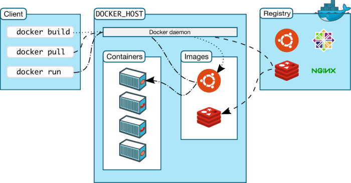

# Dépôts publics



## Obtenir une image de Docker Hub
Docker Hub est le lieu où sont stockées les images Docker ouvertes. Lorsque nous avons exécuté notre première image en tapant
```sh
$ sudo docker run --rm -p 8787:8787 rocker/verse
```

le logiciel a d’abord vérifié si cette image était disponible sur votre ordinateur et ne l’avait pas téléchargée depuis Docker Hub. Donc, obtenir une image de Docker Hub fonctionne automatiquement. Si vous voulez seulement tirer l’image mais ne pas la lancer, vous pouvez aussi le faire.
```sh
$ sudo docker pull rocker/verse
```

## Obtenir une image sur Docker Hub
Imaginez que vous avez créé votre propre image Docker et que vous souhaitez la partager avec le monde entier. Vous pouvez créer un compte sur https://hub.docker.com/. Après avoir vérifié votre courrier électronique, vous êtes prêt à télécharger votre première image de menu fixe.

1.  Connectez-vous sur https://hub.docker.com/
1.  Cliquez sur Créer un référentiel.
1.  Choisissez un nom (par exemple, verse_gapminder) et une description pour votre référentiel, puis cliquez sur Créer.
1.  Connectez-vous au hub Docker à partir de la ligne de commande
    ```sh
    $ sudo docker login --username=yourhubusername --email=youremail@company.com
    ```
    juste avec votre propre nom d'utilisateur et email que vous avez utilisé pour le compte. Entrez votre mot de passe lorsque vous y êtes invité. Si tout a fonctionné, vous recevrez un message similaire à
    ```sh
    WARNING: login credentials saved in /home/username/.docker/config.json
    Login Succeeded
    ```
1. Vérifiez l'ID de l'image à l'aide de
    ```sh
    $ sudo docker images
    ```
    and tag your image
    ```sh
    $ sudo docker tag bb38976d03cf yourhubusername/verse_gapminder:firsttry
    ```
    Le numéro doit correspondre à l'ID de l'image et: firsttry correspond à la balise. En général, un bon choix pour une balise vous aidera à comprendre à quoi ce conteneur doit être associé ou ce qu’il représente. Si ce conteneur contient l’analyse d’un papier, envisagez d’utiliser le numéro DOI ou le numéro de série de ce journal; s’il est destiné à être utilisé avec une version particulière d’un référentiel de contrôle de version de code ou de données, c’est également un bon choix - tout ce qui vous aidera à comprendre le but de cette image particulière.

1. Poussez votre image dans le référentiel que vous avez créé
    ```sh
    $ sudo docker push yourhubusername/verse_gapminder
    ```

Votre image est maintenant disponible pour tout le monde.


