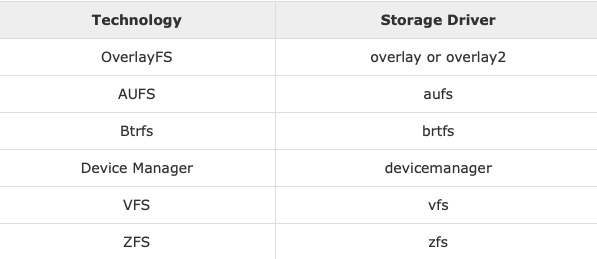
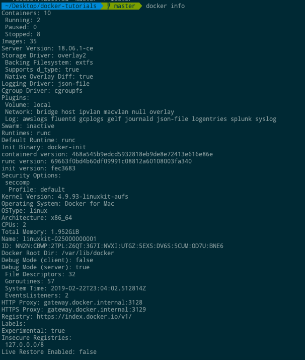

# Storage

## Storage Drivers
Docker dispose de plusieurs pilotes de stockage permettant de travailler avec les périphériques de stockage sous-jacents. Le tableau suivant répertorie les différents pilotes de stockage ainsi que la technologie utilisée pour les pilotes de stockage.



Parlons maintenant des cas dans lesquels vous utiliseriez les différents pilotes de stockage:

* AUFS
  * C'est un pilote stable. peut être utilisé pour des applications prêtes à la production.
  * Il a une bonne utilisation de la mémoire et permet de garantir une expérience fluide de Docker pour les conteneurs.
  * Une activité d'écriture élevée associée à ce pilote doit être prise en compte.
  * C’est bon pour les systèmes qui fonctionnent comme une plate-forme.

* Devicemapper
  * C'est un pilote stable. assure une expérience en douceur Docker.
  * Ce pilote est utile pour tester des applications en laboratoire.
  * Ce pilote correspond aux principales fonctionnalités du noyau Linux.

* Btrfs
  * Ce pilote correspond aux principales fonctionnalités du noyau Linux.
  * Une activité d'écriture élevée associée à ce pilote doit être prise en compte.
  * Ce pilote convient aux instances dans lesquelles vous gérez plusieurs pools de construction.

* Ovelay
  * Ce pilote est stable et conforme aux principales fonctionnalités du noyau Linux.
  * Il a une bonne utilisation de la mémoire.
  * Ce pilote est utile pour tester des applications en laboratoire.

* ZFS
  * C'est un pilote stable et il est bon pour tester des applications en laboratoire.
  * C’est bon pour les systèmes fonctionnant comme une plate-forme en tant que service.

Pour voir le pilote de stockage utilisé, lancez la commande docker info.
```sh
$ sudo docker info
```
Output:
La sortie suivante montre que le pilote principal utilisé dans le répertoire racine stocké dans /var/lib/docker.




